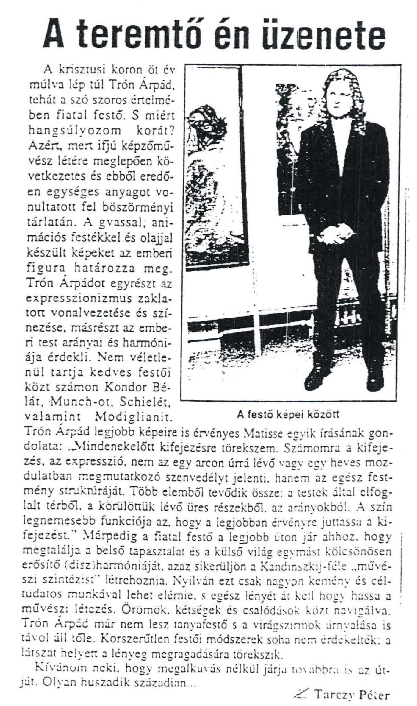

    <article class="art-post">
	

	    

		<h2>Tarczy Péter újságíró jellemzése</h2>
		<h2 style="text-align: left;">A teremtő én üzenete</h2>
		
A krisztusi koron öt év múlva lép túl Trón Árpád, tehát a szó szoros értelmében fiatal festő. S miért hangsúlyozom korát? 
		Azért, mert ifjú képzőművész létére meglepően következetes és ebből eredően egységes anyagot vonultatott fel böszörményi tárlatán.

 
		
A gvassal, animációs festékkel és olajjal készült képeket az emberi figura határozza meg. Trón Árpádot egyrészt az expresszionizmus 
		zaklatott vonalvezetése és színezése, másrészt az emberi test arányai és harmódiája érdekli. Nem véletlenül tartja kedves festői közt 
		számon Kondor Bélát, Munch-ot, Shielét, valamint Modiglianit. Trón Árpád legjobb képeire is érvényes Matisse egyik írásának gondolata: 
		"&nbsp; Mindenekelőtt kifejezésre törekszem. Számomra a kifejezés, az expresszió, nem az egy arcon úrrá levő vagy egy heves mozulatban 
		megmutatkozó szenvedélyt jelenti, hanem az egész festmény struktúráját. Több elemből tevődik össze: a testek által elfoglalt térből, a 
		körülettük levő üres részekből, az arányokból. A szín legnemesebb funkciója az, hogy a legjobban érvényre juttassa a kifejezést. " 
		Márpedig a fiatal festő a legjobb úton jár ahhoz, hogy megtalálja a belső tapasztalat és a külső világ egymást kölcsönösen erősítő 
		(disz)harmóniáját, azaz sikerüljön a Kandinszkij-féle "művészeti szintézist" létrehoznia.Nyilván ezt csak nagyon kemény és céltudatos 
		munkával lehet elérnie, s egész lényét át kell hogy hassa a művészeti létezés. Örömök, kétségek és csalódások közt navigálva. Trón Árpád 
		már nem lesz tanyafestő, s a virágszirmok árnyalása is távol áll tőle. Korszerűtlen festői módszerek soha nem érdekelték: a látszat helyett 
		a lényeg megragadására törekszik.

		
Kívánom neki, hogy megalkuvás nélkül járja tovább is az útját. Olyan huszadik századian...

		
Tarczy Péter

		
&nbsp;

		

	    

	

    </article>

