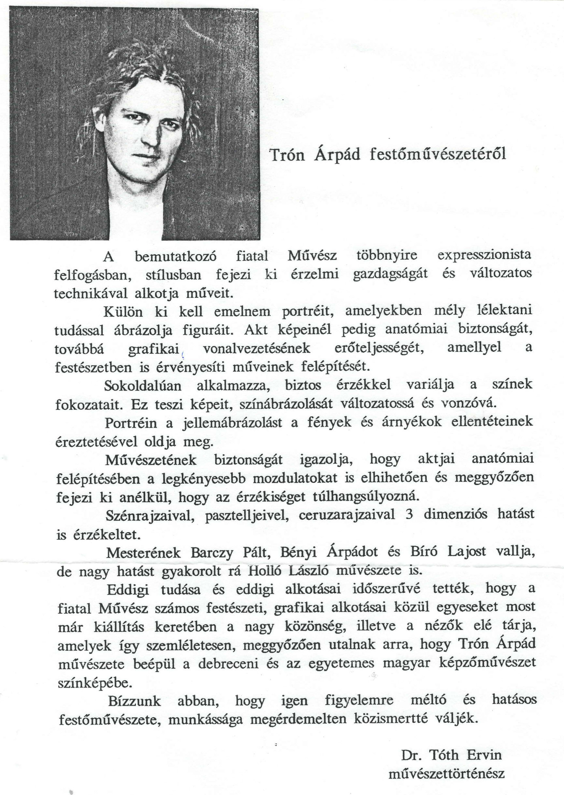

    <article class="art-post">
	

	    

		<h2>Dr. Tóth Ervin jellemzése</h2>
		<h3>Trón árpád festőművészetéről</h3>
		
 A bemutatkozó fiatal művész többnyire expresszionista felfogásban, stílusban fejezi ki érzelmi gazdagságát és változatos technikával alkotja műveit.

		
 Külön ki kell emelnem portréit, amelyekben mély lélektani tudással ábrázolja figuráit. Akt képeinel pedig anatómiai biztonságát, továbbá grafikai vonalvezetésének 
		erőteljességét, amellyel festeszetében is érvényesíti műveinek felépítését. Sokoldalúan alkalmazza, biztos érzékkel variálja a színek fokozatait, ez teszi képeit, 
		színábrázolását változatossá és vonzóva. Portréin a jellemábrázolást a fények es árnyékok ellentéteinek éreztetesevel oldja meg. Művészetének biztonságát igazolja, 
		hogy aktjai anatómiai felépítésében a legkényesebb mozdulatokat is elhihetően és meggyőzően fejezi ki anélkül, hogy az érzekiséget túlhangsúlyozná. Szénrajzaival, 
		pasztelljeivel, ceruzarajzaival 3 dimenziós hatást is érzékeltet. Mesterének Bárczy Pált, Bényi Árpádot és Lukács Gábort vallja, de nagy hatást gyakorolt rá 
		Holló Laszló műveszete is.

		
 Eddigi tudása es eddigi alkotásai időszerűvé tették, hogy a fiatal művesz számos festészeti, grafikai alkotásai közül egyeseket most már kiallítás keretében 
		a nagyközönség, illetve a nézők ele tárja, amelyek így szemléletesen, meggyőzően mutatnak arra, hogy Trón Árpád művészete beépül a debreceni és az egyetemes magyar 
		képzőművészet színképébe.

		
 Bízzunk abban, hogy igen figyelemre meltó és hatásos festőművészete, munkássága megérdemelten közismertté váljék.

		
 Dr.Tóth Ervin művészettörténész

		
 

		

	    

	

    </article>

