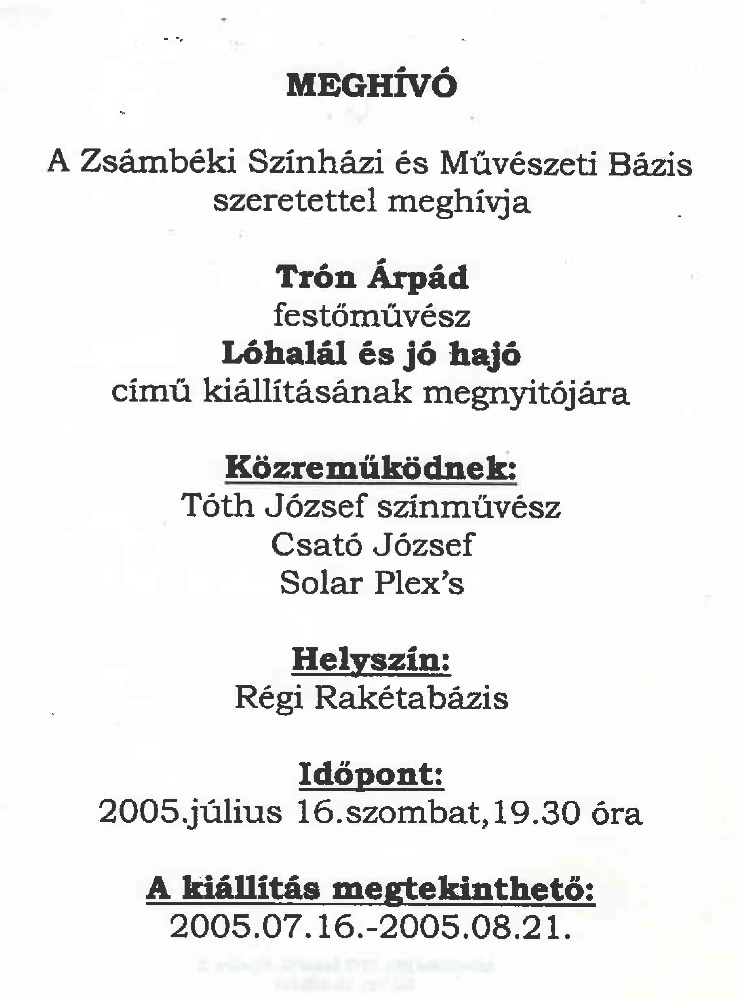

<article class="art-post">

<h1>Kiállítás 2005. Zsámbék</h1>

&nbsp;

Kiállítás helye: Zsámbéki Színházi és Művészeti Bázis

Megnyitó ideje: 2005. július 16.&nbsp; 19:30

Közreműködnek: Tóth József színművész, Csató József, Solar Plex's

Megtekinthető: 2005. 07. 16. - 2005. 08.21.

&nbsp;

&nbsp;

&nbsp;

&nbsp;

<h2>Képek a kiállításról</h2>

 

  

   

2005. július (1)

 

  

   

2005. július (2)

 

  

   

2005. július (3)

 

  

   

2005. július (4)

