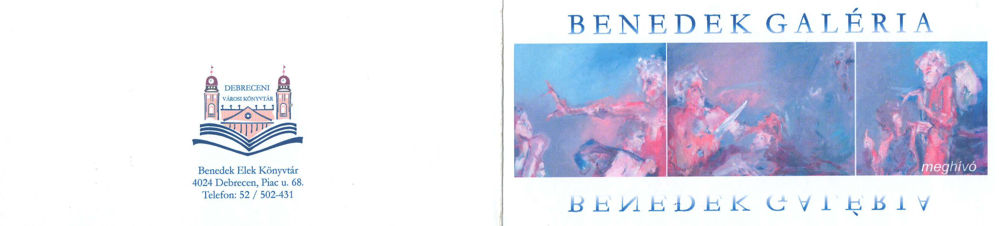
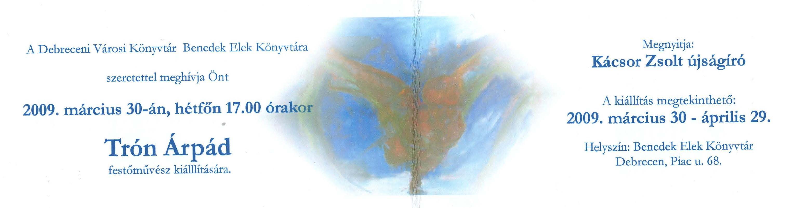

    <article class="art-post">
	

	    

		<h1>Kiállítás 2009.</h1>
		
Kiállítás helye: Debrecen, Benedek Elek Könyvtár

		
Megnyitó ideje: 2009. március 30, 17.00

		
Megnyitja: Kácsot Zsolt újságíró

		
Megtekinthető: 2009.márc. 30-ápr.29.

		
&nbsp;

		
&nbsp;

		

		

	    

	

    </article>

