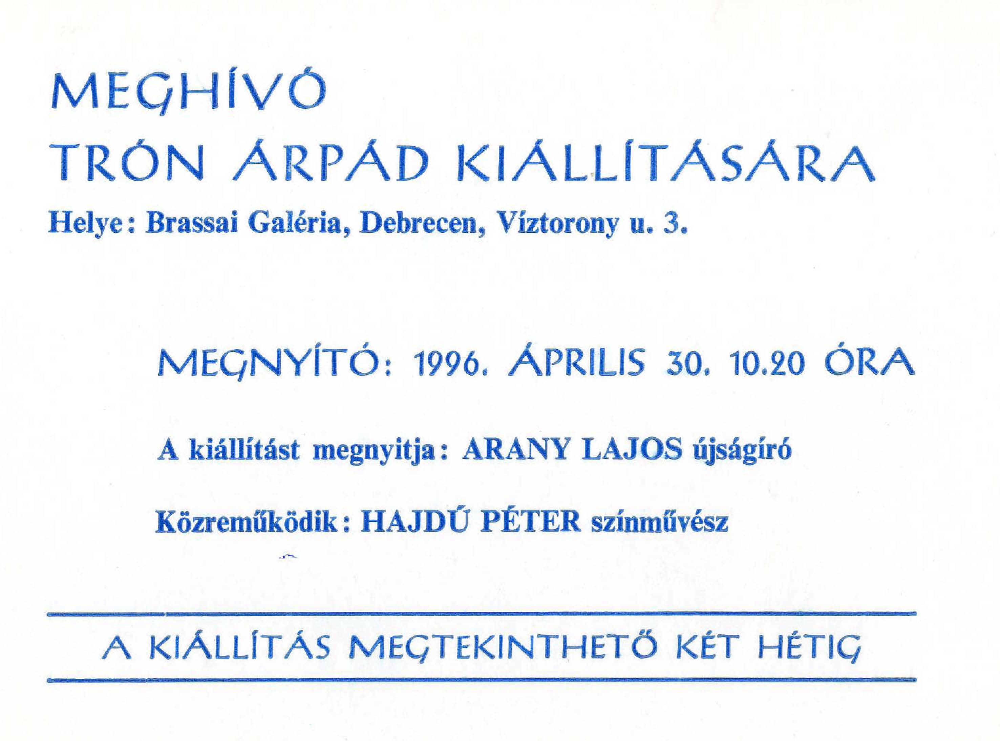

    <article class="art-post">
	

	    

		<h1>Kiállítás 1996.</h1>
		
&nbsp;

		
Helye: Brassai Galéria, Debrecen, Víztorony u. 3.

		
Megnyitó ideje: 1996. április 30. 10.20.&nbsp;

		
Kiállítást megnyitja: Arany Lajos újságíró

		
Közreműködik: Hajdú Péter színművész, Szinovál Gyula színművész

		
Kiállítás megtekinthető: 1996. május 28-ig

		
&nbsp;

		

		

		

	     

	

    </article>

