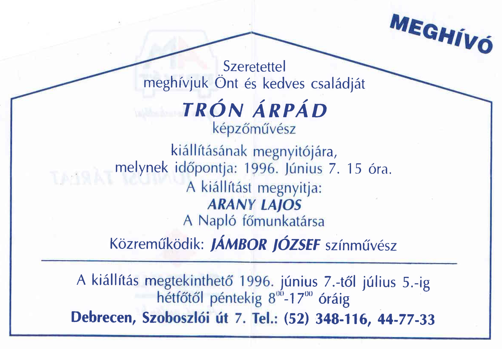
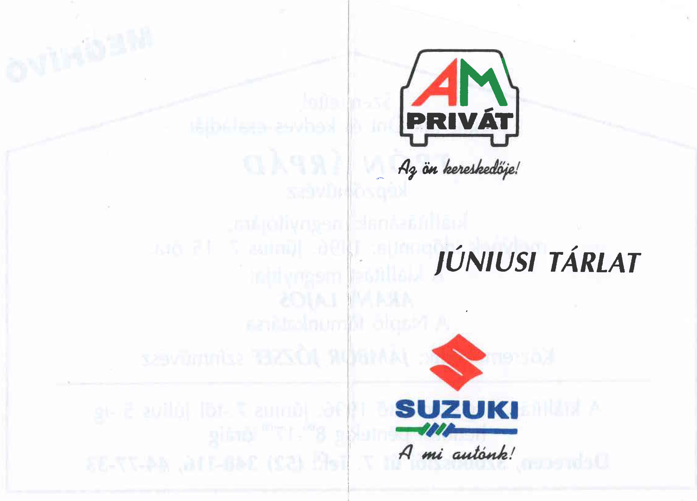

    <article class="art-post">
	

	    

		<h1 style="text-align: center;">Kiállítás 1996. június</h1>
		
Helye: Debrecen, Szoboszlói u. 7.

		
ldeje: 1996. június 7-én 15 órakor

		
Nyirvatartás: 1996. június 7-től július 5-ig

		
A kiállítást megnyitja: Arany Lajos, a Napló főmunkatársa

		
Közreműködik: Jámbor József színművész

		
&nbsp;

		
&nbsp;

		

		

		
&nbsp;

	    

	

    </article>

