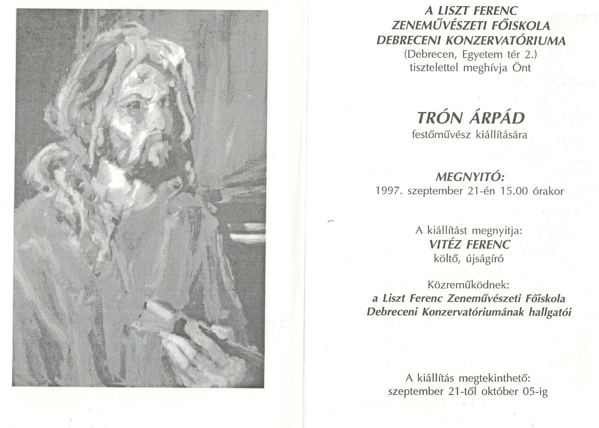
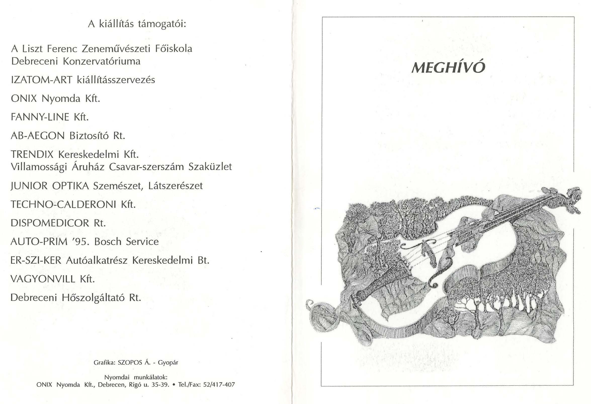

    <article class="art-post">
	

	    

		<h1>Kiállítás 1997. Debrecen</h1>
		<h1>Zeneművészeti Főiskola</h1>
		
Kiállítás helye: Liszt Ferenc Zeneművészeti Főiskola

		
Megnyitó: 1997. szept. 21. 15:00.

		
Megnyitja: Vitéz Ferenc költő, újságíró

		
Közreműködnek: Liszt Ferenc Zeneművészeti Főiskola Debreceni Konzervatóriumának hallgatói

		
Megtekinthető: 1997. szept. 21-okt. 5.

		
&nbsp;

		

		
&nbsp;

		

	    

	

    </article>

