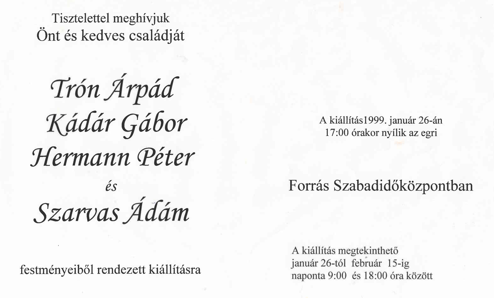

    <article class="art-post">
	

	    

		<h1>Kiállítás 1999. január</h1>
		
&nbsp;

		
Helye: Eger, Forrás Szabadidőközpont

		
ldeje: 1999. január 26-án 17 órakor

		
Megtekinthető: 1999. január 26-tól február 15-ig

		
&nbsp;

		
&nbsp;

		

	    

	

    </article>

