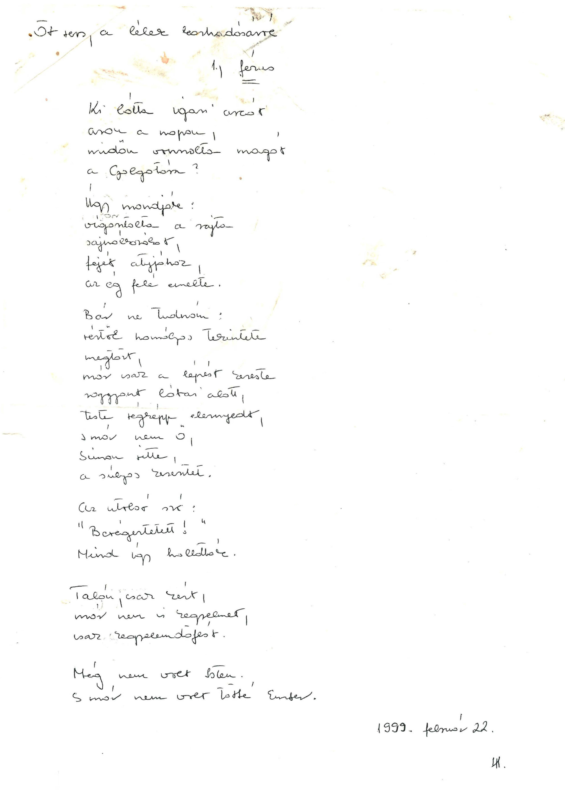
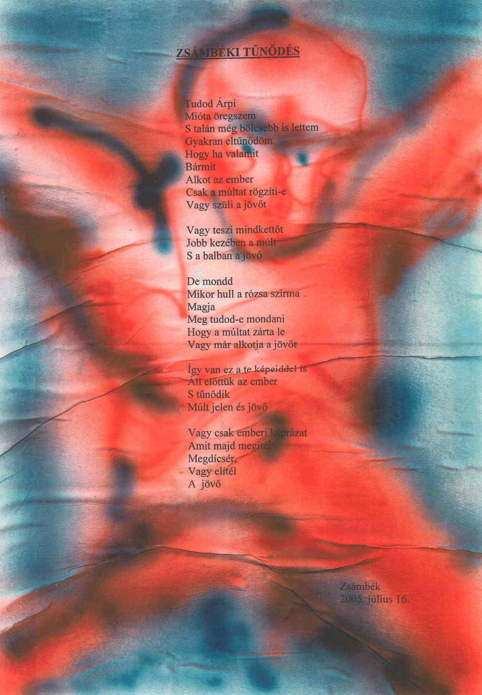

<article class="art-post">

&nbsp;<!-- [if gte mso 9]><xml>
 <o:OfficeDocumentSettings>
  <o:AllowPNG/>
 </o:OfficeDocumentSettings>
</xml><![endif]-->

<!-- [if gte mso 9]><xml>
 <w:WordDocument>
  <w:View>Normal</w:View>
  <w:Zoom>0</w:Zoom>
  <w:TrackMoves/>
  <w:TrackFormatting/>
  <w:HyphenationZone>21</w:HyphenationZone>
  <w:PunctuationKerning/>
  <w:ValidateAgainstSchemas/>
  <w:SaveIfXMLInvalid>false</w:SaveIfXMLInvalid>
  <w:IgnoreMixedContent>false</w:IgnoreMixedContent>
  <w:AlwaysShowPlaceholderText>false</w:AlwaysShowPlaceholderText>
  <w:DoNotPromoteQF/>
  <w:LidThemeOther>HU</w:LidThemeOther>
  <w:LidThemeAsian>X-NONE</w:LidThemeAsian>
  <w:LidThemeComplexScript>X-NONE</w:LidThemeComplexScript>
  <w:Compatibility>
   <w:BreakWrappedTables/>
   <w:SnapToGridInCell/>
   <w:WrapTextWithPunct/>
   <w:UseAsianBreakRules/>
   <w:DontGrowAutofit/>
   <w:SplitPgBreakAndParaMark/>
   <w:EnableOpenTypeKerning/>
   <w:DontFlipMirrorIndents/>
   <w:OverrideTableStyleHps/>
  </w:Compatibility>
  <m:mathPr>
   <m:mathFont m:val="Cambria Math"/>
   <m:brkBin m:val="before"/>
   <m:brkBinSub m:val="&#45;-"/>
   <m:smallFrac m:val="off"/>
   <m:dispDef/>
   <m:lMargin m:val="0"/>
   <m:rMargin m:val="0"/>
   <m:defJc m:val="centerGroup"/>
   <m:wrapIndent m:val="1440"/>
   <m:intLim m:val="subSup"/>
   <m:naryLim m:val="undOvr"/>
  </m:mathPr></w:WordDocument>
</xml><![endif]--><!-- [if gte mso 9]><xml>
 <w:LatentStyles DefLockedState="false" DefUnhideWhenUsed="true"
  DefSemiHidden="true" DefQFormat="false" DefPriority="99"
  LatentStyleCount="267">
  <w:LsdException Locked="false" Priority="0" SemiHidden="false"
   UnhideWhenUsed="false" QFormat="true" Name="Normal"/>
  <w:LsdException Locked="false" Priority="9" SemiHidden="false"
   UnhideWhenUsed="false" QFormat="true" Name="heading 1"/>
  <w:LsdException Locked="false" Priority="9" QFormat="true" Name="heading 2"/>
  <w:LsdException Locked="false" Priority="9" QFormat="true" Name="heading 3"/>
  <w:LsdException Locked="false" Priority="9" QFormat="true" Name="heading 4"/>
  <w:LsdException Locked="false" Priority="9" QFormat="true" Name="heading 5"/>
  <w:LsdException Locked="false" Priority="9" QFormat="true" Name="heading 6"/>
  <w:LsdException Locked="false" Priority="9" QFormat="true" Name="heading 7"/>
  <w:LsdException Locked="false" Priority="9" QFormat="true" Name="heading 8"/>
  <w:LsdException Locked="false" Priority="9" QFormat="true" Name="heading 9"/>
  <w:LsdException Locked="false" Priority="39" Name="toc 1"/>
  <w:LsdException Locked="false" Priority="39" Name="toc 2"/>
  <w:LsdException Locked="false" Priority="39" Name="toc 3"/>
  <w:LsdException Locked="false" Priority="39" Name="toc 4"/>
  <w:LsdException Locked="false" Priority="39" Name="toc 5"/>
  <w:LsdException Locked="false" Priority="39" Name="toc 6"/>
  <w:LsdException Locked="false" Priority="39" Name="toc 7"/>
  <w:LsdException Locked="false" Priority="39" Name="toc 8"/>
  <w:LsdException Locked="false" Priority="39" Name="toc 9"/>
  <w:LsdException Locked="false" Priority="35" QFormat="true" Name="caption"/>
  <w:LsdException Locked="false" Priority="10" SemiHidden="false"
   UnhideWhenUsed="false" QFormat="true" Name="Title"/>
  <w:LsdException Locked="false" Priority="1" Name="Default Paragraph Font"/>
  <w:LsdException Locked="false" Priority="11" SemiHidden="false"
   UnhideWhenUsed="false" QFormat="true" Name="Subtitle"/>
  <w:LsdException Locked="false" Priority="22" SemiHidden="false"
   UnhideWhenUsed="false" QFormat="true" Name="Strong"/>
  <w:LsdException Locked="false" Priority="20" SemiHidden="false"
   UnhideWhenUsed="false" QFormat="true" Name="Emphasis"/>
  <w:LsdException Locked="false" Priority="59" SemiHidden="false"
   UnhideWhenUsed="false" Name="Table Grid"/>
  <w:LsdException Locked="false" UnhideWhenUsed="false" Name="Placeholder Text"/>
  <w:LsdException Locked="false" Priority="1" SemiHidden="false"
   UnhideWhenUsed="false" QFormat="true" Name="No Spacing"/>
  <w:LsdException Locked="false" Priority="60" SemiHidden="false"
   UnhideWhenUsed="false" Name="Light Shading"/>
  <w:LsdException Locked="false" Priority="61" SemiHidden="false"
   UnhideWhenUsed="false" Name="Light List"/>
  <w:LsdException Locked="false" Priority="62" SemiHidden="false"
   UnhideWhenUsed="false" Name="Light Grid"/>
  <w:LsdException Locked="false" Priority="63" SemiHidden="false"
   UnhideWhenUsed="false" Name="Medium Shading 1"/>
  <w:LsdException Locked="false" Priority="64" SemiHidden="false"
   UnhideWhenUsed="false" Name="Medium Shading 2"/>
  <w:LsdException Locked="false" Priority="65" SemiHidden="false"
   UnhideWhenUsed="false" Name="Medium List 1"/>
  <w:LsdException Locked="false" Priority="66" SemiHidden="false"
   UnhideWhenUsed="false" Name="Medium List 2"/>
  <w:LsdException Locked="false" Priority="67" SemiHidden="false"
   UnhideWhenUsed="false" Name="Medium Grid 1"/>
  <w:LsdException Locked="false" Priority="68" SemiHidden="false"
   UnhideWhenUsed="false" Name="Medium Grid 2"/>
  <w:LsdException Locked="false" Priority="69" SemiHidden="false"
   UnhideWhenUsed="false" Name="Medium Grid 3"/>
  <w:LsdException Locked="false" Priority="70" SemiHidden="false"
   UnhideWhenUsed="false" Name="Dark List"/>
  <w:LsdException Locked="false" Priority="71" SemiHidden="false"
   UnhideWhenUsed="false" Name="Colorful Shading"/>
  <w:LsdException Locked="false" Priority="72" SemiHidden="false"
   UnhideWhenUsed="false" Name="Colorful List"/>
  <w:LsdException Locked="false" Priority="73" SemiHidden="false"
   UnhideWhenUsed="false" Name="Colorful Grid"/>
  <w:LsdException Locked="false" Priority="60" SemiHidden="false"
   UnhideWhenUsed="false" Name="Light Shading Accent 1"/>
  <w:LsdException Locked="false" Priority="61" SemiHidden="false"
   UnhideWhenUsed="false" Name="Light List Accent 1"/>
  <w:LsdException Locked="false" Priority="62" SemiHidden="false"
   UnhideWhenUsed="false" Name="Light Grid Accent 1"/>
  <w:LsdException Locked="false" Priority="63" SemiHidden="false"
   UnhideWhenUsed="false" Name="Medium Shading 1 Accent 1"/>
  <w:LsdException Locked="false" Priority="64" SemiHidden="false"
   UnhideWhenUsed="false" Name="Medium Shading 2 Accent 1"/>
  <w:LsdException Locked="false" Priority="65" SemiHidden="false"
   UnhideWhenUsed="false" Name="Medium List 1 Accent 1"/>
  <w:LsdException Locked="false" UnhideWhenUsed="false" Name="Revision"/>
  <w:LsdException Locked="false" Priority="34" SemiHidden="false"
   UnhideWhenUsed="false" QFormat="true" Name="List Paragraph"/>
  <w:LsdException Locked="false" Priority="29" SemiHidden="false"
   UnhideWhenUsed="false" QFormat="true" Name="Quote"/>
  <w:LsdException Locked="false" Priority="30" SemiHidden="false"
   UnhideWhenUsed="false" QFormat="true" Name="Intense Quote"/>
  <w:LsdException Locked="false" Priority="66" SemiHidden="false"
   UnhideWhenUsed="false" Name="Medium List 2 Accent 1"/>
  <w:LsdException Locked="false" Priority="67" SemiHidden="false"
   UnhideWhenUsed="false" Name="Medium Grid 1 Accent 1"/>
  <w:LsdException Locked="false" Priority="68" SemiHidden="false"
   UnhideWhenUsed="false" Name="Medium Grid 2 Accent 1"/>
  <w:LsdException Locked="false" Priority="69" SemiHidden="false"
   UnhideWhenUsed="false" Name="Medium Grid 3 Accent 1"/>
  <w:LsdException Locked="false" Priority="70" SemiHidden="false"
   UnhideWhenUsed="false" Name="Dark List Accent 1"/>
  <w:LsdException Locked="false" Priority="71" SemiHidden="false"
   UnhideWhenUsed="false" Name="Colorful Shading Accent 1"/>
  <w:LsdException Locked="false" Priority="72" SemiHidden="false"
   UnhideWhenUsed="false" Name="Colorful List Accent 1"/>
  <w:LsdException Locked="false" Priority="73" SemiHidden="false"
   UnhideWhenUsed="false" Name="Colorful Grid Accent 1"/>
  <w:LsdException Locked="false" Priority="60" SemiHidden="false"
   UnhideWhenUsed="false" Name="Light Shading Accent 2"/>
  <w:LsdException Locked="false" Priority="61" SemiHidden="false"
   UnhideWhenUsed="false" Name="Light List Accent 2"/>
  <w:LsdException Locked="false" Priority="62" SemiHidden="false"
   UnhideWhenUsed="false" Name="Light Grid Accent 2"/>
  <w:LsdException Locked="false" Priority="63" SemiHidden="false"
   UnhideWhenUsed="false" Name="Medium Shading 1 Accent 2"/>
  <w:LsdException Locked="false" Priority="64" SemiHidden="false"
   UnhideWhenUsed="false" Name="Medium Shading 2 Accent 2"/>
  <w:LsdException Locked="false" Priority="65" SemiHidden="false"
   UnhideWhenUsed="false" Name="Medium List 1 Accent 2"/>
  <w:LsdException Locked="false" Priority="66" SemiHidden="false"
   UnhideWhenUsed="false" Name="Medium List 2 Accent 2"/>
  <w:LsdException Locked="false" Priority="67" SemiHidden="false"
   UnhideWhenUsed="false" Name="Medium Grid 1 Accent 2"/>
  <w:LsdException Locked="false" Priority="68" SemiHidden="false"
   UnhideWhenUsed="false" Name="Medium Grid 2 Accent 2"/>
  <w:LsdException Locked="false" Priority="69" SemiHidden="false"
   UnhideWhenUsed="false" Name="Medium Grid 3 Accent 2"/>
  <w:LsdException Locked="false" Priority="70" SemiHidden="false"
   UnhideWhenUsed="false" Name="Dark List Accent 2"/>
  <w:LsdException Locked="false" Priority="71" SemiHidden="false"
   UnhideWhenUsed="false" Name="Colorful Shading Accent 2"/>
  <w:LsdException Locked="false" Priority="72" SemiHidden="false"
   UnhideWhenUsed="false" Name="Colorful List Accent 2"/>
  <w:LsdException Locked="false" Priority="73" SemiHidden="false"
   UnhideWhenUsed="false" Name="Colorful Grid Accent 2"/>
  <w:LsdException Locked="false" Priority="60" SemiHidden="false"
   UnhideWhenUsed="false" Name="Light Shading Accent 3"/>
  <w:LsdException Locked="false" Priority="61" SemiHidden="false"
   UnhideWhenUsed="false" Name="Light List Accent 3"/>
  <w:LsdException Locked="false" Priority="62" SemiHidden="false"
   UnhideWhenUsed="false" Name="Light Grid Accent 3"/>
  <w:LsdException Locked="false" Priority="63" SemiHidden="false"
   UnhideWhenUsed="false" Name="Medium Shading 1 Accent 3"/>
  <w:LsdException Locked="false" Priority="64" SemiHidden="false"
   UnhideWhenUsed="false" Name="Medium Shading 2 Accent 3"/>
  <w:LsdException Locked="false" Priority="65" SemiHidden="false"
   UnhideWhenUsed="false" Name="Medium List 1 Accent 3"/>
  <w:LsdException Locked="false" Priority="66" SemiHidden="false"
   UnhideWhenUsed="false" Name="Medium List 2 Accent 3"/>
  <w:LsdException Locked="false" Priority="67" SemiHidden="false"
   UnhideWhenUsed="false" Name="Medium Grid 1 Accent 3"/>
  <w:LsdException Locked="false" Priority="68" SemiHidden="false"
   UnhideWhenUsed="false" Name="Medium Grid 2 Accent 3"/>
  <w:LsdException Locked="false" Priority="69" SemiHidden="false"
   UnhideWhenUsed="false" Name="Medium Grid 3 Accent 3"/>
  <w:LsdException Locked="false" Priority="70" SemiHidden="false"
   UnhideWhenUsed="false" Name="Dark List Accent 3"/>
  <w:LsdException Locked="false" Priority="71" SemiHidden="false"
   UnhideWhenUsed="false" Name="Colorful Shading Accent 3"/>
  <w:LsdException Locked="false" Priority="72" SemiHidden="false"
   UnhideWhenUsed="false" Name="Colorful List Accent 3"/>
  <w:LsdException Locked="false" Priority="73" SemiHidden="false"
   UnhideWhenUsed="false" Name="Colorful Grid Accent 3"/>
  <w:LsdException Locked="false" Priority="60" SemiHidden="false"
   UnhideWhenUsed="false" Name="Light Shading Accent 4"/>
  <w:LsdException Locked="false" Priority="61" SemiHidden="false"
   UnhideWhenUsed="false" Name="Light List Accent 4"/>
  <w:LsdException Locked="false" Priority="62" SemiHidden="false"
   UnhideWhenUsed="false" Name="Light Grid Accent 4"/>
  <w:LsdException Locked="false" Priority="63" SemiHidden="false"
   UnhideWhenUsed="false" Name="Medium Shading 1 Accent 4"/>
  <w:LsdException Locked="false" Priority="64" SemiHidden="false"
   UnhideWhenUsed="false" Name="Medium Shading 2 Accent 4"/>
  <w:LsdException Locked="false" Priority="65" SemiHidden="false"
   UnhideWhenUsed="false" Name="Medium List 1 Accent 4"/>
  <w:LsdException Locked="false" Priority="66" SemiHidden="false"
   UnhideWhenUsed="false" Name="Medium List 2 Accent 4"/>
  <w:LsdException Locked="false" Priority="67" SemiHidden="false"
   UnhideWhenUsed="false" Name="Medium Grid 1 Accent 4"/>
  <w:LsdException Locked="false" Priority="68" SemiHidden="false"
   UnhideWhenUsed="false" Name="Medium Grid 2 Accent 4"/>
  <w:LsdException Locked="false" Priority="69" SemiHidden="false"
   UnhideWhenUsed="false" Name="Medium Grid 3 Accent 4"/>
  <w:LsdException Locked="false" Priority="70" SemiHidden="false"
   UnhideWhenUsed="false" Name="Dark List Accent 4"/>
  <w:LsdException Locked="false" Priority="71" SemiHidden="false"
   UnhideWhenUsed="false" Name="Colorful Shading Accent 4"/>
  <w:LsdException Locked="false" Priority="72" SemiHidden="false"
   UnhideWhenUsed="false" Name="Colorful List Accent 4"/>
  <w:LsdException Locked="false" Priority="73" SemiHidden="false"
   UnhideWhenUsed="false" Name="Colorful Grid Accent 4"/>
  <w:LsdException Locked="false" Priority="60" SemiHidden="false"
   UnhideWhenUsed="false" Name="Light Shading Accent 5"/>
  <w:LsdException Locked="false" Priority="61" SemiHidden="false"
   UnhideWhenUsed="false" Name="Light List Accent 5"/>
  <w:LsdException Locked="false" Priority="62" SemiHidden="false"
   UnhideWhenUsed="false" Name="Light Grid Accent 5"/>
  <w:LsdException Locked="false" Priority="63" SemiHidden="false"
   UnhideWhenUsed="false" Name="Medium Shading 1 Accent 5"/>
  <w:LsdException Locked="false" Priority="64" SemiHidden="false"
   UnhideWhenUsed="false" Name="Medium Shading 2 Accent 5"/>
  <w:LsdException Locked="false" Priority="65" SemiHidden="false"
   UnhideWhenUsed="false" Name="Medium List 1 Accent 5"/>
  <w:LsdException Locked="false" Priority="66" SemiHidden="false"
   UnhideWhenUsed="false" Name="Medium List 2 Accent 5"/>
  <w:LsdException Locked="false" Priority="67" SemiHidden="false"
   UnhideWhenUsed="false" Name="Medium Grid 1 Accent 5"/>
  <w:LsdException Locked="false" Priority="68" SemiHidden="false"
   UnhideWhenUsed="false" Name="Medium Grid 2 Accent 5"/>
  <w:LsdException Locked="false" Priority="69" SemiHidden="false"
   UnhideWhenUsed="false" Name="Medium Grid 3 Accent 5"/>
  <w:LsdException Locked="false" Priority="70" SemiHidden="false"
   UnhideWhenUsed="false" Name="Dark List Accent 5"/>
  <w:LsdException Locked="false" Priority="71" SemiHidden="false"
   UnhideWhenUsed="false" Name="Colorful Shading Accent 5"/>
  <w:LsdException Locked="false" Priority="72" SemiHidden="false"
   UnhideWhenUsed="false" Name="Colorful List Accent 5"/>
  <w:LsdException Locked="false" Priority="73" SemiHidden="false"
   UnhideWhenUsed="false" Name="Colorful Grid Accent 5"/>
  <w:LsdException Locked="false" Priority="60" SemiHidden="false"
   UnhideWhenUsed="false" Name="Light Shading Accent 6"/>
  <w:LsdException Locked="false" Priority="61" SemiHidden="false"
   UnhideWhenUsed="false" Name="Light List Accent 6"/>
  <w:LsdException Locked="false" Priority="62" SemiHidden="false"
   UnhideWhenUsed="false" Name="Light Grid Accent 6"/>
  <w:LsdException Locked="false" Priority="63" SemiHidden="false"
   UnhideWhenUsed="false" Name="Medium Shading 1 Accent 6"/>
  <w:LsdException Locked="false" Priority="64" SemiHidden="false"
   UnhideWhenUsed="false" Name="Medium Shading 2 Accent 6"/>
  <w:LsdException Locked="false" Priority="65" SemiHidden="false"
   UnhideWhenUsed="false" Name="Medium List 1 Accent 6"/>
  <w:LsdException Locked="false" Priority="66" SemiHidden="false"
   UnhideWhenUsed="false" Name="Medium List 2 Accent 6"/>
  <w:LsdException Locked="false" Priority="67" SemiHidden="false"
   UnhideWhenUsed="false" Name="Medium Grid 1 Accent 6"/>
  <w:LsdException Locked="false" Priority="68" SemiHidden="false"
   UnhideWhenUsed="false" Name="Medium Grid 2 Accent 6"/>
  <w:LsdException Locked="false" Priority="69" SemiHidden="false"
   UnhideWhenUsed="false" Name="Medium Grid 3 Accent 6"/>
  <w:LsdException Locked="false" Priority="70" SemiHidden="false"
   UnhideWhenUsed="false" Name="Dark List Accent 6"/>
  <w:LsdException Locked="false" Priority="71" SemiHidden="false"
   UnhideWhenUsed="false" Name="Colorful Shading Accent 6"/>
  <w:LsdException Locked="false" Priority="72" SemiHidden="false"
   UnhideWhenUsed="false" Name="Colorful List Accent 6"/>
  <w:LsdException Locked="false" Priority="73" SemiHidden="false"
   UnhideWhenUsed="false" Name="Colorful Grid Accent 6"/>
  <w:LsdException Locked="false" Priority="19" SemiHidden="false"
   UnhideWhenUsed="false" QFormat="true" Name="Subtle Emphasis"/>
  <w:LsdException Locked="false" Priority="21" SemiHidden="false"
   UnhideWhenUsed="false" QFormat="true" Name="Intense Emphasis"/>
  <w:LsdException Locked="false" Priority="31" SemiHidden="false"
   UnhideWhenUsed="false" QFormat="true" Name="Subtle Reference"/>
  <w:LsdException Locked="false" Priority="32" SemiHidden="false"
   UnhideWhenUsed="false" QFormat="true" Name="Intense Reference"/>
  <w:LsdException Locked="false" Priority="33" SemiHidden="false"
   UnhideWhenUsed="false" QFormat="true" Name="Book Title"/>
  <w:LsdException Locked="false" Priority="37" Name="Bibliography"/>
  <w:LsdException Locked="false" Priority="39" QFormat="true" Name="TOC Heading"/>
 </w:LatentStyles>
</xml><![endif]--><!-- [if gte mso 10]>

<![endif]-->

Jézus

&nbsp;

Ki látta igazi arcát

azon a napon

midőn vonszolta magát

a Golgotára?

&nbsp;

Úgy mondják:

vígasztalta a rajta

sajnálkozókat,

fejét atyjához,

az ég felé emelte.

&nbsp;

Bár ne tudnám:

vértől homályos tekintete

megtört,

már csak a lépést kereste

roggyant lábai alatt,

teste végképp elernyedt,

s már nem ő,

Simon vitte,

a súlyos keresztet.

&nbsp;

Az utolsó szó:

” Bevégeztetett! ”

Mind így hallották.

&nbsp;

Talán, csak kért,

már nem is kegyelmet,

csak kegyelemdöfést.

&nbsp;

Még nem volt Isten.

S már nem volt többé Ember.

&nbsp;(1999. febr. 22.)

&nbsp;

 

</article>

